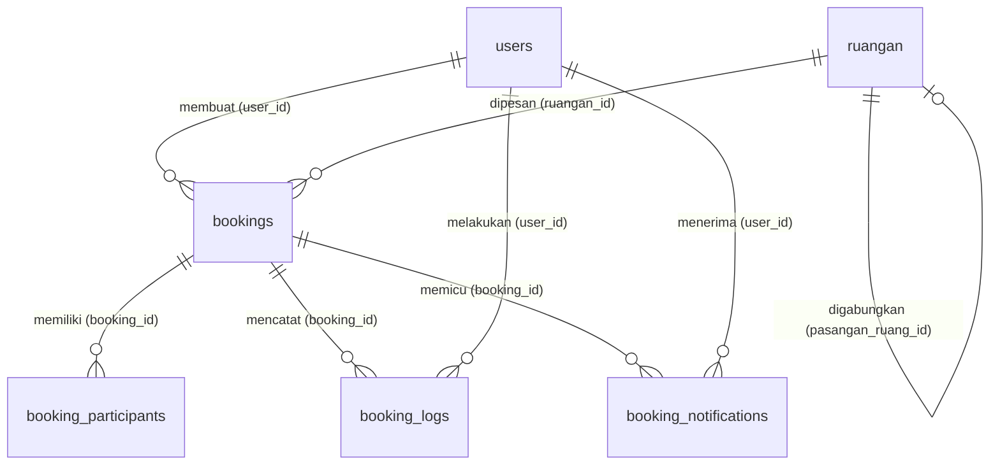
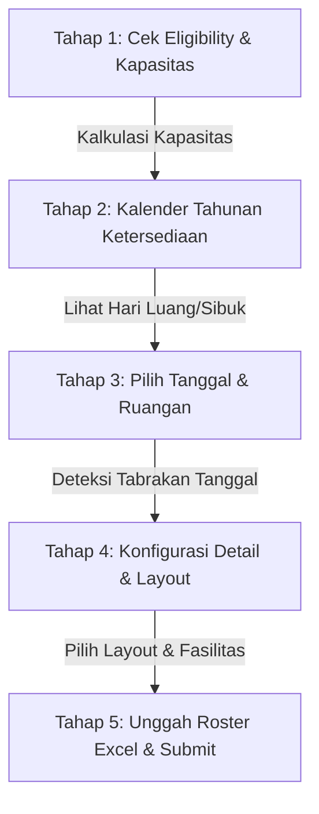

# Dokumen Fitur dan Fungsi: Enterprise Training Management System (Booking System)

Dokumen ini disusun untuk menyelaraskan pemahaman antara Pengguna dan AI mengenai arsitektur, database, fitur, serta alur bisnis yang diimplementasikan pada aplikasi **Enterprise Training Management System**.

---

## 1. Stack Teknologi & Framework
Aplikasi ini dibangun menggunakan arsitektur modern yang memisahkan backend dan frontend secara seamless:
*   **Backend (Server-Side):** Laravel 13+ (PHP 8.3+) dengan integrasi ORM Eloquent, database migrations, dan transaksi basis data yang kuat.
*   **Frontend (Client-Side):** Vue.js 3 (Composition API dengan `<script setup>`) yang dinamis dan reaktif.
*   **Bridge/Penghubung:** Inertia.js (menghubungkan Laravel & Vue tanpa memerlukan REST API terpisah, sehingga performa cepat dan navigasi SPA *Single Page Application*).
*   **Desain & Styling:** Tailwind CSS v4 untuk tampilan premium, modern, bersih, dan responsif.
*   **Pustaka Tambahan:**
    *   `phpoffice/phpspreadsheet`: Untuk validasi presisi tinggi berkas excel asli (`.xlsx`) secara dinamis.
    *   `@fullcalendar/vue3`: Untuk kalender interaktif penjadwalan training secara visual.
    *   `tightenco/ziggy`: Menyediakan rute Laravel langsung di dalam JavaScript/Vue.

---

## 2. Struktur Database & Model Data (Normalization & Integrity)

Desain database telah ternormalisasi dengan baik untuk menjaga integritas data tinggi, menghindari anomali, serta mengoptimalkan kecepatan pencarian menggunakan indeks database yang presisi.

### A. Tabel `users`
Menyimpan data pengguna aplikasi, baik staff divisi maupun administrator.
*   `id` (Primary Key)
*   `name` (Nama pengguna)
*   `email` (Email unik untuk login)
*   `password` (Password terenkripsi)
*   `role` (Hak akses: `user` atau `admin`)
*   `divisi` (Nama divisi/departemen pemohon)

### B. Tabel `ruangan` (Model: `Ruangan`)
Menyimpan data ruangan kelas training dengan dukungan fitur penggabungan ruang fisik (*self-referencing relationship*).
*   `id` (Primary Key)
*   `nama_ruang` (Nama ruangan, misal: *Ruang 1*, *Ruang 2*)
*   `lokasi_gedung` (Gedung lokasi)
*   `kapasitas_max` (Kapasitas maksimum peserta)
*   `bisa_digabung` (Boolean: `true` jika bisa digabung dengan ruang sebelahnya)
*   `pasangan_ruang_id` (Foreign Key menunjuk ke `ruangan.id` — relasi self-referencing untuk mendefinisikan pasangan gabungan seperti *Ruang 2 + Ruang 3*)

### C. Tabel `bookings` (Model: `Booking`)
Tabel utama untuk merekam informasi pemesanan ruangan.
*   `id` (Primary Key)
*   `user_id` (Foreign Key ke `users.id`)
*   `ruangan_id` (Foreign Key ke `ruangan.id`)
*   `nama_training` (Nama pelatihan/kegiatan)
*   `tgl_mulai` & `tgl_selesai` (Rentang tanggal pelatihan)
*   `fase` (Enum: `plotting` = pemesanan jauh hari, `reguler` = pemesanan normal)
*   `status` (Enum: `plotting` → `waiting_confirmation` → `confirmed` / `cancelled`)
*   `pic` (Nama *Person In Charge* dari pemohon)
*   `gabung_ruang` (Boolean: menandai jika pemesanan menggunakan gabungan Ruang 2 + Ruang 3)
*   `layout_preferensi` (Pilihan layout: `classroom`, `u-shape`, `i-shape`, `o-shape`, `custom`)
*   `layout_custom_path` (Path file gambar/PDF layout ruangan kustom jika diunggah)
*   `is_hybrid` & `is_flipchart` (Boolean untuk kebutuhan fasilitas tambahan)
*   `catatan_admin` (Catatan dari admin, atau alasan penolakan jika booking ditolak)
*   `acc1_at` & `acc1_by` (Log persetujuan awal tahap 1 oleh admin)

### D. Tabel `booking_participants` (Model: `BookingParticipant`)
Menyimpan daftar nama peserta dan panitia dari berkas Excel yang diunggah.
*   `id` (Primary Key)
*   `booking_id` (Foreign Key ke `bookings.id`)
*   `tipe` (Enum: `peserta`, `panitia`)
*   `nama` (Nama lengkap)
*   `jabatan` (Jabatan/posisi)
*   `site` (Lokasi site kerja)
*   `gender` (Char: `L` atau `P` — divalidasi ketat)

### E. Tabel `booking_windows` (Model: `BookingWindow`)
Mengatur kapan sistem booking dibuka untuk umum.
*   `id` (Primary Key)
*   `nama_periode` (Misal: *Periode 2026*)
*   `tahun` (Tahun periode berjalan)
*   `is_active` (Boolean: status buka/tutup window)
*   `start_date` & `end_date` (Rentang aktif window)

### F. Tabel `booking_logs` & `booking_notifications`
Mencatat riwayat aktivitas administratif (*audit trail*) dan mengirimkan alert notifikasi sistem ke pengguna ketika status booking disetujui atau ditolak.

---

## 3. Fitur Utama & Alur Bisnis (Business Flow)

Aplikasi memiliki dua sudut pandang pengguna utama: **User (Pemohon Divisi)** dan **Admin (Pusat Pelatihan)**.

### ── ALUR PENGGUNA (USER INTERFACE & FLOW) ──

#### A. Dashboard User & Kalender Interaktif
*   **Kalender Visual (FullCalendar):** Menampilkan jadwal kegiatan training yang sudah disetujui (*confirmed*) serta yang masih menunggu persetujuan (*pending*), membantu user melihat ketersediaan ruang sebelum memesan.
*   **Penyaringan Ruangan:** Filter tampilan kalender berdasarkan ruangan tertentu.
*   **Notifikasi Real-time:** Menampilkan lonceng notifikasi (misal: "Booking Anda untuk 'Basic Safety' telah disetujui"). Notifikasi dapat ditandai sebagai terbaca secara instan.
*   **Development Switch Role:** Tombol dev-only untuk berganti peran antara Admin dan User secara cepat untuk keperluan uji coba.

#### B. Alur Pemesanan 5 Tahap (Booking Wizard)
Fitur unggulan berupa wizard multi-tahap yang memandu user agar pemesanan terisi dengan akurat:

1.  **Tahap 1 — Cek Eligibility & Kapasitas:**
    *   User memasukkan jumlah peserta dan panitia.
    *   Sistem menghitung total orang dan menyaring ruangan yang muat:
        *   Total $\le 25$ orang $\rightarrow$ Semua ruangan layak.
        *   Total $26 - 30$ orang $\rightarrow$ Layak untuk semua ruangan *kecuali* Ruang 5 dan Ruang 6 (kapasitas kecil).
        *   Total $31 - 60$ orang $\rightarrow$ Diarahkan otomatis ke **Ruang Gabungan 2 + 3**.
        *   Total $> 60$ orang $\rightarrow$ Ditolak otomatis oleh sistem karena melebihi kapasitas maksimum gedung.
2.  **Tahap 2 — Kalender Tahunan Ketersediaan:**
    *   Menampilkan kalender setahun penuh untuk melihat hari mana saja yang berstatus **Full** (semua ruangan terisi) atau **Partial** (beberapa ruangan terisi) agar user dapat memilih tanggal yang paling longgar.
3.  **Tahap 3 — Pilih Tanggal & Ruangan:**
    *   User memilih tanggal mulai dan selesai kegiatan.
    *   Sistem melakukan pengecekan real-time ke database dan menampilkan daftar ruangan yang benar-benar **Available** (tidak bertabrakan dengan jadwal terkonfirmasi lain) pada rentang tanggal tersebut.
4.  **Tahap 4 — Konfigurasi Detail & Layout:**
    *   User mengisi Nama Training dan nama PIC kegiatan.
    *   Memilih layout meja/kursi (`Classroom`, `U-Shape`, `I-Shape`, `O-Shape`).
    *   Dukungan **Custom Layout**: User dapat mengunggah file denah kustom sendiri (`JPEG`, `PNG`, `PDF`) yang akan tersimpan aman di server.
    *   Opsi Fasilitas Tambahan: Centang kebutuhan konektivitas `Hybrid` dan papan tulis `Flipchart`.
5.  **Tahap 5 — Unggah Roster Excel & Submit:**
    *   User mengunduh template Excel resmi dari sistem (`template_peserta_baru_kosong.xlsx`).
    *   User mengisi data panitia dan peserta, lalu mengunggahnya kembali.
    *   **Validasi Presisi Excel (PhpSpreadsheet):** Sistem membaca file Excel langsung dari baris ke-5 menggunakan koordinat sel A, B, C, D:
        *   Kolom A (Nama Lengkap), B (Jabatan), C (Site) wajib diisi.
        *   Kolom D (Jenis Kelamin) wajib berisi huruf **L** atau **P** (Case Insensitive).
        *   Jika ada kesalahan format pada baris tertentu, sistem akan langsung menampilkan pesan error informatif (misal: *"Baris ke-8 Gagal. Jenis Kelamin harus berisi L atau P!"*) dan membatalkan submit demi menjaga kesucian data.
    *   **Pessimistic Locking:** Saat submit ditekan, sistem mengunci baris ruangan bersangkutan (`lockForUpdate`) di database untuk menghindari kasus *Double Booking* jika dua user menekan tombol submit bersamaan di detik yang sama.

#### C. Riwayat Pemesanan (Booking History)
*   Menampilkan tabel seluruh pengajuan pemesanan yang pernah dilakukan oleh user login tersebut beserta status terbarunya (`Waiting Confirmation`, `Confirmed`, atau `Cancelled`).

---

### ── ALUR ADMINISTRATOR (ADMIN INTERFACE & CONTROL) ──

#### A. Dashboard Utama Admin & Statistik Indikator
Dashboard admin didesain premium untuk kontrol pengawasan penuh dengan metrik instan:
1.  **Metrik Utama (4 Kartu Statistik):**
    *   *Menunggu Persetujuan:* Jumlah total antrean booking yang berstatus `waiting_confirmation`.
    *   *Disetujui Bulan Ini:* Jumlah kegiatan berstatus `confirmed` pada bulan berjalan.
    *   *Urgent H-14:* Pengajuan belum diproses yang tanggal mulainya $\le 14$ hari dari hari ini (membutuhkan tindakan segera).
    *   *Ruangan Terpakai Hari Ini:* Jumlah ruangan fisik yang sedang aktif dipakai kegiatan hari ini.
2.  **Notifikasi Cerdas terintegrasi (Smart Alert Box):**
    *   Menampilkan daftar pekerjaan rumah admin yang diurutkan berdasarkan skala prioritas:
        *   *Lewat Tenggat (Overdue):* Pengajuan pending yang tanggal kegiatannya sudah lewat.
        *   *Urgent H-14:* Pengajuan pending yang akan mulai dalam 2 minggu ke depan.
        *   *Booking Baru:* Pengajuan masuk terbaru.
3.  **Kalender Pengawasan Global:**
    *   Melihat jadwal seluruh ruangan terkonfirmasi dalam format kalender tahunan/bulanan dengan filter interaktif per ruangan.

#### B. Manajemen Booking Window (Buka/Tutup Periode)
*   Admin dapat membuka **Booking Window** baru dengan menentukan Tahun Periode, Tanggal Mulai, dan Tanggal Selesai. Selama window ditutup, user biasa tidak dapat membuat pengajuan baru.
*   **Aturan Penutupan Aman:** Admin tidak dapat menutup booking window yang sedang berjalan jika masih ada pengajuan user yang berstatus `waiting_confirmation`. Admin wajib menyelesaikan seluruh antrean terlebih dahulu (Disetujui/Ditolak) untuk menjamin keadilan pelayanan divisi.

#### C. Persetujuan & Penolakan Pengajuan (Booking Approval)
*   **Halaman Inbox Persetujuan:** Admin dapat melihat daftar rinci pengajuan yang diurutkan secara tertib:
    *   Untuk antrean pending, urutan dari yang **terlama masuk** (*First In First Out*) agar pelayanan adil.
    *   Untuk tab riwayat selesai, urutan dari yang **terbaru**.
*   **Proses Approval Konflik-Aman (Safe Approve):**
    *   Saat admin menyetujui, sistem melakukan pemeriksaan silang ulang (*double check database collision*) dengan proteksi database lock untuk memastikan tidak ada booking confirmed lain yang bertabrakan di tanggal dan ruangan yang sama.
    *   Jika aman, status diubah menjadi `confirmed`, tercatat di log administratif, dan notifikasi langsung dikirim ke user pemohon.
*   **Proses Reject Transparan (Reject with Cause):**
    *   Jika menolak, Admin **wajib menuliskan catatan alasan penolakan** (misal: *"Ruangan sedang dalam masa perawatan AC"*). Alasan ini akan tercatat dalam `catatan_admin` dan tampil transparan di layar riwayat milik user.

---

## 4. Keunggulan Sistem ini

1.  **Anti Double-Booking:** Dilengkapi mekanisme `lockForUpdate` di level database untuk mencegah bentrokan jadwal akibat persaingan akses konkuren (*race condition*).
2.  **Kecerdasan Kapasitas Ruang:** Sistem secara pintar mendeteksi batas kapasitas dan menyarankan penggabungan ruangan (Ruang 2 + Ruang 3) secara otomatis tanpa perlu intervensi manual.
3.  **Pembersihan Data Hulu (Excel Validation):** Validasi roster peserta langsung dilakukan saat upload di frontend menggunakan pustaka PhpSpreadsheet, memastikan data yang masuk ke database 100% valid dan rapi.
4.  **Aman untuk Masa Depan:** Memiliki fitur Booking Window yang dinamis, memudahkan perencanaan kelas training tahunan yang teratur.
